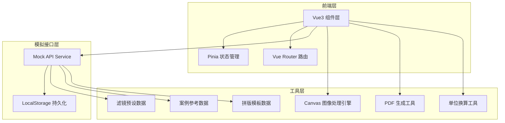
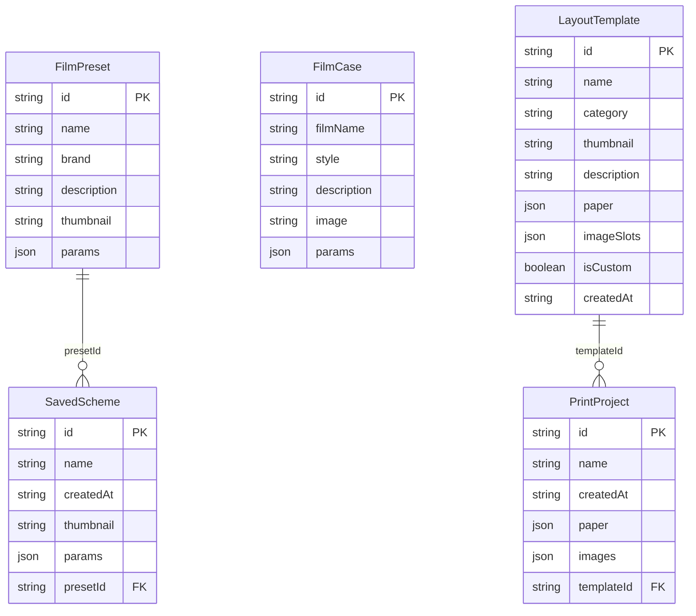

## 1. 架构设计



## 2. 技术说明
- **前端框架**：Vue3 + TypeScript + Composition API
- **构建工具**：Vite
- **样式方案**：Tailwind CSS + CSS Variables（主题切换）
- **状态管理**：Pinia
- **路由**：Vue Router 4
- **图标库**：lucide-vue-next
- **PDF 生成**：jsPDF（客户端生成）
- **初始化工具**：vite-init（vue-ts 模板）
- **后端**：无（纯前端），全局封装模拟接口层完成数据交互
- **持久化**：LocalStorage 存储已保存方案、自定义模板
- **图像处理**：HTML5 Canvas API，支持像素级操作

## 3. 路由定义
| 路由 | 用途 |
|------|------|
| `/` | 编辑器页面 — 图片上传、滤镜预设、参数调节、实时预览、方案保存与导出 |
| `/gallery` | 案例库页面 — 经典胶片风格案例参考、已保存方案管理 |
| `/print-layout` | 打印排版页面 — 新建打印项目、纸张设置、多图拼版、智能排版、模板管理、打印预览与导出 |

## 4. API 定义（模拟接口）

### 4.1 滤镜预设接口
```typescript
interface FilmPreset {
  id: string
  name: string
  brand: string
  description: string
  thumbnail: string
  params: FilterParams
}

interface FilterParams {
  brightness: number
  contrast: number
  temperature: number
  grain: number
  saturate: number
  sepia: number
  hueRotate: number
}
```

### 4.2 调色方案接口
```typescript
interface SavedScheme {
  id: string
  name: string
  createdAt: string
  thumbnail: string
  params: FilterParams
  presetId?: string
}
```

### 4.3 经典案例接口
```typescript
interface FilmCase {
  id: string
  filmName: string
  style: string
  description: string
  image: string
  params: FilterParams
}
```

### 4.4 打印排版相关接口
```typescript
// 纸张规格
interface PaperSize {
  id: string
  name: string
  width: number  // mm
  height: number // mm
  isCustom?: boolean
}

// 打印项目配置
interface PrintProject {
  id: string
  name: string
  createdAt: string
  paper: PaperConfig
  images: PrintImage[]
  templateId?: string
}

// 纸张配置
interface PaperConfig {
  size: PaperSize
  orientation: 'portrait' | 'landscape'  // 纵向/横向
  margins: {
    top: number     // mm
    right: number   // mm
    bottom: number  // mm
    left: number    // mm
  }
  dpi: number  // 150 | 300 | 600
}

// 打印图片元素
interface PrintImage {
  id: string
  src: string
  name: string
  originalWidth: number
  originalHeight: number
  x: number           // 画布上的 X 位置 (mm)
  y: number           // 画布上的 Y 位置 (mm)
  width: number       // 显示宽度 (mm)
  height: number      // 显示高度 (mm)
  rotation: number    // 旋转角度 (0.1° 精度)
  zIndex: number      // 图层层级
  crop: CropConfig | null
  border: BorderConfig | null
  filterParams: FilterParams
}

// 裁剪配置
interface CropConfig {
  x: number      // 裁剪起始 X (原图比例 0-1)
  y: number      // 裁剪起始 Y (原图比例 0-1)
  width: number  // 裁剪宽度 (原图比例 0-1)
  height: number // 裁剪高度 (原图比例 0-1)
}

// 边框配置
interface BorderConfig {
  width: number       // 边框宽度 (mm)
  color: string       // 边框颜色
  borderRadius: number // 圆角半径 (mm)
  shadow: ShadowConfig | null
}

// 阴影配置
interface ShadowConfig {
  offsetX: number   // mm
  offsetY: number   // mm
  blur: number      // mm
  color: string
  opacity: number   // 0-1
}

// 拼版模板
interface LayoutTemplate {
  id: string
  name: string
  category: 'id' | 'polaroid' | 'photowall' | 'comparison' | 'custom'
  thumbnail: string
  description: string
  paper: PaperConfig
  imageSlots: ImageSlot[]
  isCustom?: boolean
  createdAt?: string
}

// 模板图片槽位
interface ImageSlot {
  x: number
  y: number
  width: number
  height: number
  rotation?: number
  border?: BorderConfig | null
}

// 打印预览配置
interface PrintPreviewConfig {
  paperTexture: 'glossy' | 'matte' | 'fineart' | 'xuanzhi' | 'none'
  textureIntensity: number  // 0-100
  inkSimulation: 'inkjet' | 'laser' | 'silver' | 'none'
  lighting: 'indoor' | 'window' | 'sunlight'
  showBleed: boolean
  showCropMarks: boolean
  bleedSize: number  // mm
}

// 智能排版设置
interface SmartLayoutConfig {
  showGuides: boolean
  snapToGuides: boolean
  showGrid: boolean
  gridSize: number   // mm
  snapToGrid: boolean
  guideSensitivity: number  // 吸附敏感度 (像素)
}

// 导出配置
interface ExportConfig {
  format: 'pdf' | 'jpg' | 'png' | 'tiff'
  quality: number  // 0-100 (for jpg)
  includeCropMarks: boolean
  colorProfile: 'srgb' | 'adobergb' | 'cmyk'
}
```

### 4.5 模拟 API 列表
| 方法 | 路径 | 描述 |
|------|------|------|
| GET | `/api/presets` | 获取所有胶卷滤镜预设 |
| GET | `/api/presets/:id` | 获取单个滤镜预设详情 |
| GET | `/api/cases` | 获取经典胶片案例列表 |
| GET | `/api/schemes` | 获取已保存方案列表 |
| POST | `/api/schemes` | 保存新方案 |
| DELETE | `/api/schemes/:id` | 删除已保存方案 |
| POST | `/api/export` | 导出效果图（触发 Canvas 下载） |
| GET | `/api/paper-sizes` | 获取预设纸张规格列表 |
| GET | `/api/templates` | 获取拼版模板列表（内置+自定义） |
| POST | `/api/templates` | 保存自定义模板 |
| DELETE | `/api/templates/:id` | 删除自定义模板 |
| GET | `/api/print-projects` | 获取已保存打印项目列表 |
| POST | `/api/print-projects` | 保存打印项目 |
| DELETE | `/api/print-projects/:id` | 删除打印项目 |

## 5. 数据模型

### 5.1 数据模型定义


### 5.2 单位换算说明
- 所有内部计算使用毫米 (mm) 作为基准单位
- 像素换算公式：像素 = 毫米 × DPI / 25.4
- 支持单位：mm, cm, 英寸 (inch)
- 画布渲染时根据缩放比例实时换算为屏幕像素

### 5.3 Canvas 渲染层级
1. 背景层：工作台深色背景
2. 纸张层：白色纸张 + 阴影效果
3. 辅助层：网格线、对齐辅助线、出血线、裁切线
4. 图片层：按 zIndex 顺序渲染各图片元素
5. 交互层：选中框、控制点、旋转手柄、裁剪遮罩

## 6. 项目目录结构

```
src/
├── api/                  # 模拟接口层
│   ├── mock.ts           # 模拟数据定义
│   ├── presets.ts        # 滤镜预设接口
│   ├── schemes.ts        # 方案管理接口
│   ├── cases.ts          # 案例参考接口
│   ├── templates.ts      # 拼版模板接口
│   └── printProjects.ts  # 打印项目接口
├── assets/               # 静态资源
├── components/           # 公共组件
│   ├── Navbar.vue        # 导航栏
│   ├── ThemeToggle.vue   # 主题切换
│   ├── ImageUploader.vue # 图片上传
│   ├── PreviewCanvas.vue # 预览画布
│   ├── PresetSlider.vue  # 滤镜预设滑块
│   ├── ParamControl.vue  # 参数调节控件
│   ├── HistoryPanel.vue  # 历史记录面板
│   ├── SaveSchemeDialog.vue # 保存方案对话框
│   ├── print/            # 打印排版组件目录
│   │   ├── PaperSettings.vue    # 纸张设置面板
│   │   ├── LayoutCanvas.vue     # 拼版画布
│   │   ├── ImageProperty.vue    # 图片属性面板
│   │   ├── SmartLayoutToolbar.vue # 智能排版工具栏
│   │   ├── TemplatePanel.vue    # 模板面板
│   │   ├── PrintPreview.vue     # 打印预览对话框
│   │   ├── ExportBar.vue        # 导出操作栏
│   │   ├── Ruler.vue            # 标尺组件
│   │   ├── ImageItem.vue        # 可交互图片元素
│   │   └── CropOverlay.vue      # 裁剪遮罩
├── composables/          # 组合式函数
│   ├── useTheme.ts       # 主题切换逻辑
│   ├── useImageFilter.ts # 图像滤镜处理
│   ├── useExport.ts      # 导出逻辑
│   ├── useUnitConversion.ts # 单位换算
│   ├── usePrintLayout.ts # 拼版交互逻辑
│   ├── usePrintPreview.ts # 打印预览渲染
│   └── usePdfExport.ts   # PDF 导出逻辑
├── pages/                # 页面组件
│   ├── Editor.vue        # 编辑器页面
│   ├── Gallery.vue       # 案例库页面
│   └── PrintLayout.vue   # 打印排版页面
├── stores/               # Pinia 状态
│   ├── editor.ts         # 编辑器状态
│   ├── gallery.ts        # 案例库状态
│   ├── theme.ts          # 主题状态
│   └── printLayout.ts    # 打印排版状态
├── types/                # TypeScript 类型
│   └── index.ts
├── lib/                  # 工具函数
│   ├── utils.ts          # 通用工具
│   ├── unitConversion.ts # 单位换算
│   └── pdfGenerator.ts   # PDF 生成器
├── router/               # 路由配置
│   └── index.ts
├── App.vue
└── main.ts
```

## 7. 核心技术实现方案

### 7.1 单位换算系统
- 统一使用 mm 作为内部存储单位
- 提供 mm ↔ px ↔ cm ↔ inch 的双向换算
- DPI 变化时自动重新计算所有像素尺寸
- 实时显示毫米和像素双单位

### 7.2 Canvas 渲染引擎
- 使用 requestAnimationFrame 实现流畅动画
- 分层渲染提高性能
- 支持图片拖拽、缩放、旋转的矩阵变换
- 离屏 Canvas 处理滤镜效果

### 7.3 智能排版算法
- 对齐辅助线：检测边缘、中心、页边距的临近关系
- 网格吸附：按自定义网格大小对齐
- 等间距分布：计算选中元素的平均间距
- 尺寸统一：以第一个选中元素为基准统一尺寸

### 7.4 打印预览模拟
- 纸张纹理：Canvas 噪声算法模拟不同纸张质感
- 墨色模拟：颜色矩阵转换模拟喷墨/激光/银盐冲印效果
- 光照模拟：叠加不同色温、亮度的光照层

### 7.5 PDF 导出
- 使用 jsPDF 客户端生成标准 PDF
- 嵌入裁剪标记和色彩配置信息
- 支持多页 PDF 生成
- 保持打印分辨率（DPI）进行像素渲染
