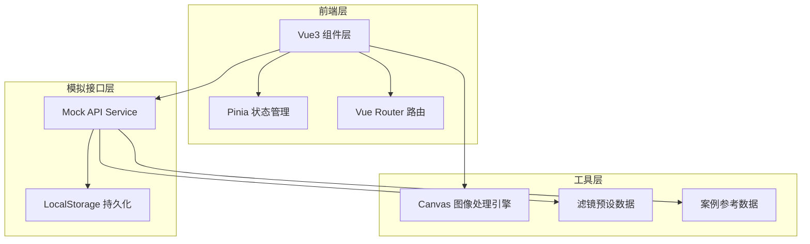
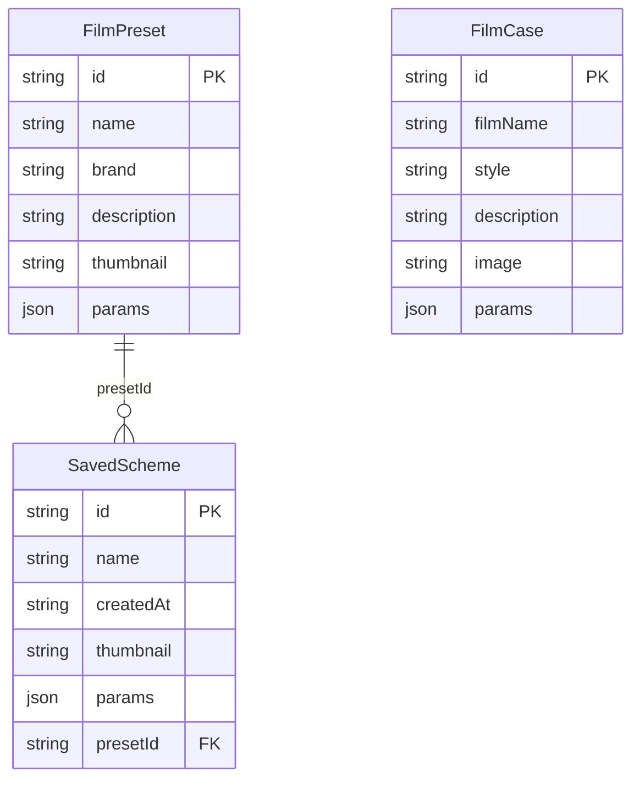

## 1. 架构设计



## 2. 技术说明
- **前端框架**：Vue3 + TypeScript + Composition API
- **构建工具**：Vite
- **样式方案**：Tailwind CSS + CSS Variables（主题切换）
- **状态管理**：Pinia
- **路由**：Vue Router 4
- **图标库**：lucide-vue-next
- **初始化工具**：vite-init（vue-ts 模板）
- **后端**：无（纯前端），全局封装模拟接口层完成数据交互
- **持久化**：LocalStorage 存储已保存方案

## 3. 路由定义
| 路由 | 用途 |
|------|------|
| `/` | 编辑器页面 — 图片上传、滤镜预设、参数调节、实时预览、方案保存与导出 |
| `/gallery` | 案例库页面 — 经典胶片风格案例参考、已保存方案管理 |

## 4. API 定义（模拟接口）

### 4.1 滤镜预设接口
```typescript
interface FilmPreset {
  id: string
  name: string
  brand: string
  description: string
  thumbnail: string
  params: FilterParams
}

interface FilterParams {
  brightness: number
  contrast: number
  temperature: number
  grain: number
  saturate: number
  sepia: number
  hueRotate: number
}
```

### 4.2 调色方案接口
```typescript
interface SavedScheme {
  id: string
  name: string
  createdAt: string
  thumbnail: string
  params: FilterParams
  presetId?: string
}
```

### 4.3 经典案例接口
```typescript
interface FilmCase {
  id: string
  filmName: string
  style: string
  description: string
  image: string
  params: FilterParams
}
```

### 4.4 模拟 API 列表
| 方法 | 路径 | 描述 |
|------|------|------|
| GET | `/api/presets` | 获取所有胶卷滤镜预设 |
| GET | `/api/presets/:id` | 获取单个滤镜预设详情 |
| GET | `/api/cases` | 获取经典胶片案例列表 |
| GET | `/api/schemes` | 获取已保存方案列表 |
| POST | `/api/schemes` | 保存新方案 |
| DELETE | `/api/schemes/:id` | 删除已保存方案 |
| POST | `/api/export` | 导出效果图（触发 Canvas 下载） |

## 5. 数据模型

### 5.1 数据模型定义


## 6. 项目目录结构

```
src/
├── api/                  # 模拟接口层
│   ├── mock.ts           # 模拟数据定义
│   ├── presets.ts        # 滤镜预设接口
│   ├── schemes.ts        # 方案管理接口
│   └── cases.ts          # 案例参考接口
├── assets/               # 静态资源
├── components/           # 公共组件
│   ├── Navbar.vue        # 导航栏
│   ├── ThemeToggle.vue   # 主题切换
│   ├── FilmStrip.vue     # 胶卷条装饰
│   ├── ImageUploader.vue # 图片上传
│   ├── PreviewCanvas.vue # 预览画布
│   ├── PresetSlider.vue  # 滤镜预设滑块
│   ├── ParamControl.vue  # 参数调节控件
│   └── CompareSlider.vue # 对比滑块
├── composables/          # 组合式函数
│   ├── useTheme.ts       # 主题切换逻辑
│   ├── useImageFilter.ts # 图像滤镜处理
│   └── useExport.ts      # 导出逻辑
├── pages/                # 页面组件
│   ├── Editor.vue        # 编辑器页面
│   └── Gallery.vue       # 案例库页面
├── stores/               # Pinia 状态
│   ├── editor.ts         # 编辑器状态
│   ├── gallery.ts        # 案例库状态
│   └── theme.ts          # 主题状态
├── types/                # TypeScript 类型
│   └── index.ts
├── router/               # 路由配置
│   └── index.ts
├── App.vue
└── main.ts
```
